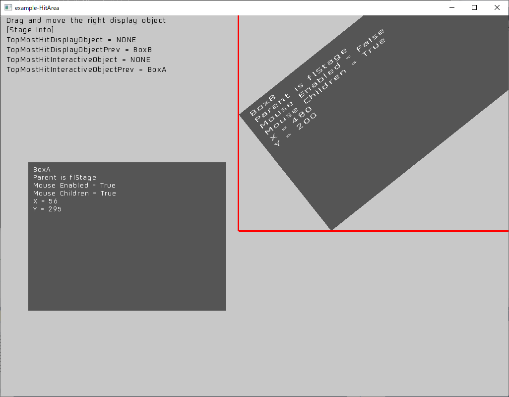
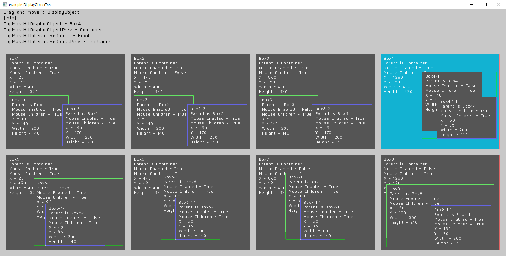
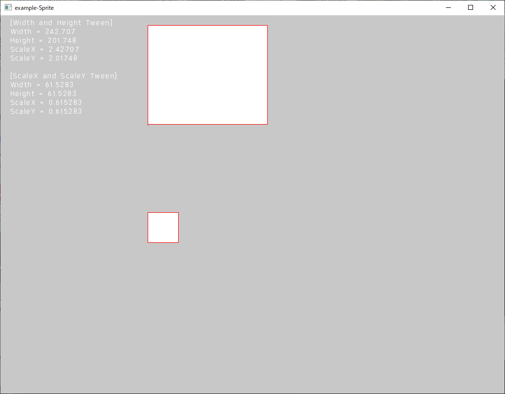
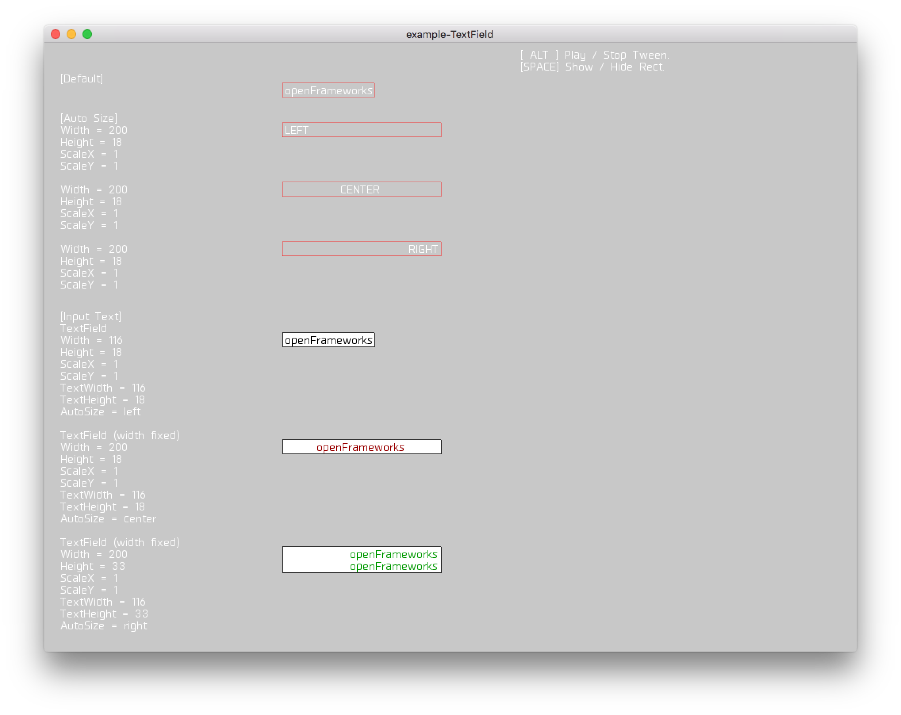
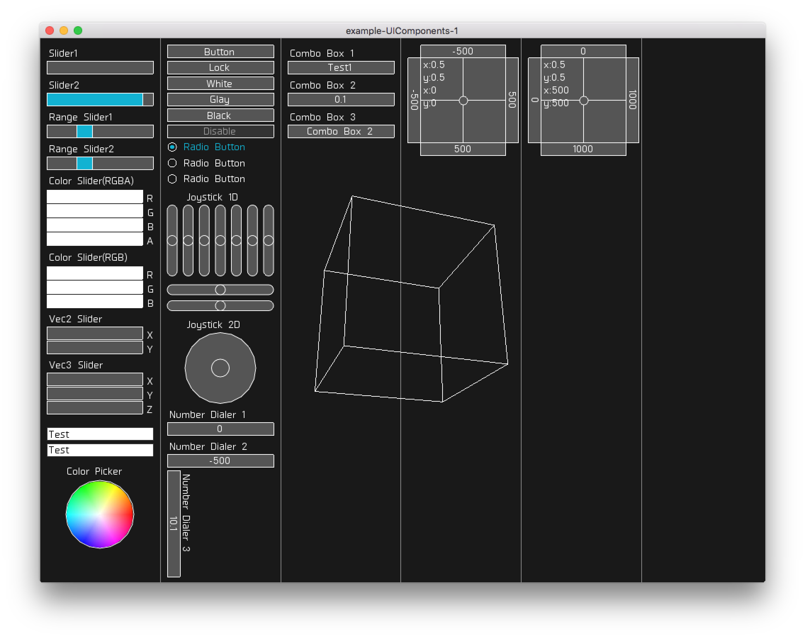

# ofxSelflash ver0.5.1
=========

last update 2016.11.4

Copyright (c) 2015 selflash

MIT License.

Description:
--------

ofxSelflash is addon to be able to write a code like AS3 on openFrameworks0.9.7

+ 'fl2d' package is classes like built-in classes of ActionScript3.0.
+ 'fl3d' package is classes that imitated classes of PaperVision3D.
+ 'tween' package is classes that imitated TweenMax API.

This addon is still in development.
The following example is unable to build.

+ example-3D-1
+ example-3D-2
+ example-3D-Deferred-1
+ example-BasicController
+ example-BlendMode
+ example-MovieClip
+ example-Tweener-1
+ example-Tweener-2
+ example-Tweener-3
+ example-Tweener-4
+ example-Tweener-5
+ example-Tweener-6

example-DisplayObjectTree
https://vimeo.com/117660748


ScreenShot
--------

+ example-3D-1
+ example-3D-2
+ example-3D-Deferred-1
+ example-BasicController
+ example-BlendMode
+ example-EventDispatcher-1
+ example-EventDispatcher-2
+ example-HitArea

+ example-MovieClip
+ example-DisplayObjectTree

+ example-Sprite

+ example-TextField

+ example-Tweener-1
+ example-Tweener-2
+ example-Tweener-3
+ example-Tweener-4
+ example-Tweener-5
+ example-Tweener-6
+ example-UIComponents-1


Requirements
--------

Features:
--------

+ ofxSelflash.h

[fl2d]
+ Flash2D.h
+ FlashConfig.h

[fl2d.core](https://github.com/selflash/ofxSelflash/wiki/core)
+ core/Object.h

[fl2d.display](https://github.com/selflash/ofxSelflash/wiki/display)
+ display/Stage.h
+ display/MovieClip.h
+ display/Sprite.h
+ display/DisplayObjectContainer.h
+ display/InteractiveObject.h
+ display/BitmapData.h
+ display/Bitmap.h
+ display/Graphics.h
+ display/Shape.h
+ display/DisplayObject.h
+ display/BlendMode.h

[fl2d.events](https://github.com/selflash/ofxSelflash/wiki/events)
+ events/EventDispatcher.h
+ events/Event.h
+ events/SoundEvent.h
+ events/AnimationEvent.h
+ events/FocusEvent.h
+ events/MouseEvent.h
+ events/KeyboardEvent.h
+ events/SliderEvent.h
+ events/Vec2SliderEvent.h
+ events/Vec3SliderEvent.h
+ events/SliderEvent.h
+ events/ButtonEvent.h
+ events/RadioButtonEvent.h
+ events/NumberDialerEvent.h
+ events/RangeSliderEvent.h
+ events/ColorSliderEvent.h
+ events/ColorPickerEvent.h
+ events/PadEvent.h
+ events/Joystick1DEvent.h
+ events/Joystick2DEvent.h
+ events/ComboBoxEvent.h
+ events/ButtonEvent.h

[fl2d.geom](https://github.com/selflash/ofxSelflash/wiki/geom)
+ geom/ColorTransform.h
+ geom/Matrix.h
+ geom/Particle2D.h
+ geom/Rectangle.h
+ geom/Transform.h

[fl2d.net](https://github.com/selflash/ofxSelflash/wiki/net)
+ net/Loader.h

[flash.texts](https://github.com/selflash/ofxSelflash/wiki/texts)
+ texts/Font.h
+ texts/TextField.h
+ texts/TextFieldAutoSize.h

[fl2d.ui](https://github.com/selflash/ofxSelflash/wiki/ui)
+ ui/Mouse.h
+ ui/Keyboard.h
+ ui/Button.h
+ ui/RadioButton.h
+ ui/NumberDialer.h
+ ui/Slider.h
+ ui/Vec2Slider.h
+ ui/Vec3Slider.h
+ ui/RangeSlider.h
+ ui/ColorSlider.h
+ ui/CircleColorPicker.h
+ ui/Pad2D.h
+ ui/Pad3D.h
+ ui/Joystick1D.h
+ ui/Joystick2D.h
+ ui/ScrollKit.h
+ ui/ComboBox.h"

[fl3d.primitive]   
[fl3d.render]  
[fl3d.camera]  
[fl3d.light]  

[fltw]
+ CallBackFuncion.h
+ DelayedCallFunction.h
+ ofxSTweener.h
+ ofxSTweener2D.h
+ STween.h
+ STweenCore.h
+ STweener.h
+ STweeneSelector.h

[fltw.fl2d]  
[fltw.fl3d]  


Getting Started
--------

- Simple example: 

```cpp
void ofApp::setup() {
    //Ready ofxSelflash
    ofxSelflash::setup();
    
    //Get stage reference
    flStage* stage = ofxSelflash::stage();
    
    //Create new sprite
    flSprite* sprite = new flSprite();
    //Set position
    sprite->x(100);
    sprite->y(200);
    
    //Draw graphics
    flGraphics* g;
    g = sprite->graphics();
    g->clear();
    g->lineStyle(1, 0xff0000);
    g->beginFill(0xffffff);
    g->drawRect(0, 0, 100, 100);
    g->endFill();
    
    //Add to display-object-tree
    stage->addChild(sprite);
    
    //When you wanna remove sprite
    //stage->removeChild(sprite);
}
```

Updates:
--------

Ver 0.5.1 - 2015.11.4
+ [Fixed] can build on openFrameworks0.9.7

Ver 0.5.0 - 2015.9.15
+ [Remove] fltw.*  (Tween Library)

+ [Remove] events.JoystickEvent.h
+ [Remove] ui.Joystick.h

+ [Add] events.Joystick1DEvent.h
+ [Add] events.Joystick2DEvent.h
+ [Add] ui.Joystick1D.h
+ [Add] ui.Joystick2D.h
+ [Add] events.ButtonEvent.h