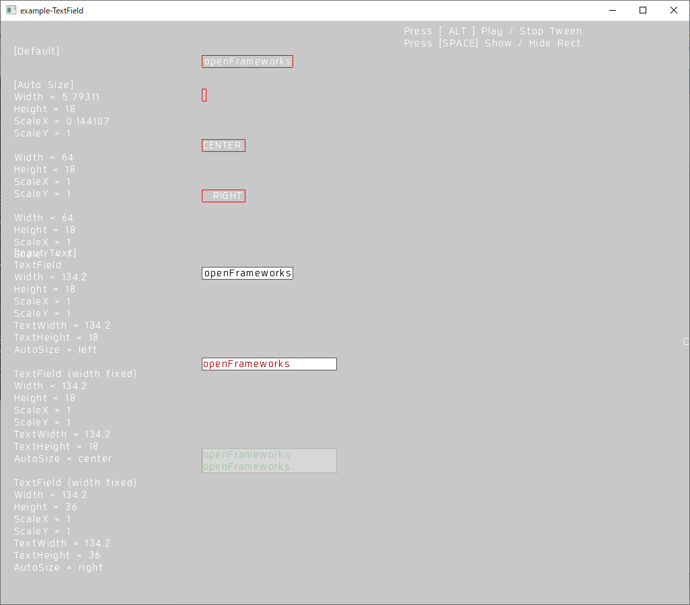
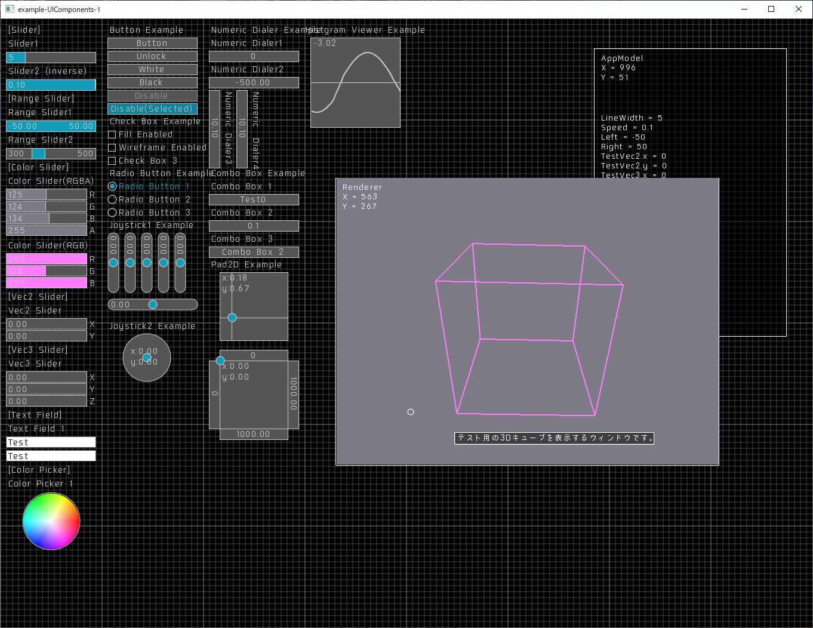
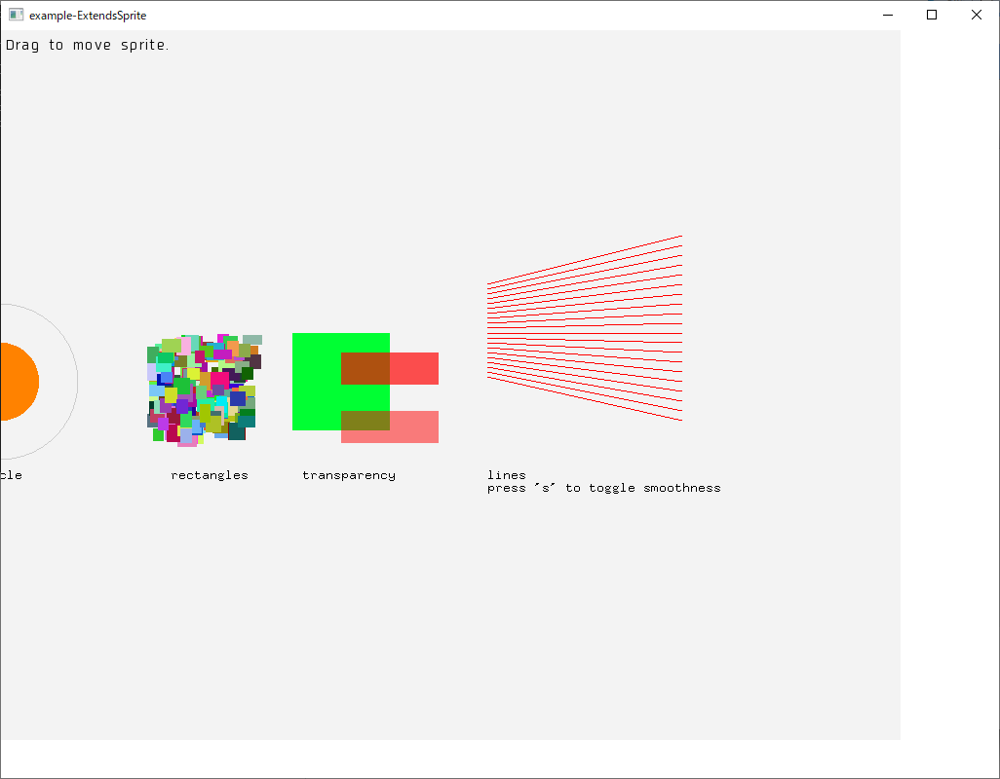

# ofxSelflash ver0.9.1
=========

Last update 2020.5.21

Copyright (c) 2015 selflash

MIT License.

Description:
--------

ofxSelflash is an addon that allows you to write code like AS3 on openFrameworks.
The operation has been confirmed on oepnFrameworks 0.10.1 on macOS Sierra and Windows10.

+ "fl2d" package is classes in imitation of ActionScript3.0.      
~+ A "fl3d" package is classes in imitation of PaperVision3D.~   
~+ A "tween" package is classes in imitation of TweenMax.~   

This addon is still in development.
Following examples are unable to build.

~+ example-3D-1~   
~+ example-3D-2~   
~+ example-3D-Deferred-1~   
+ example-BasicController
+ example-BlendMode
+ example-MovieClip   
~+ example-Tweener-1~   
~+ example-Tweener-2~   
~+ example-Tweener-3~   
~+ example-Tweener-4~   
~+ example-Tweener-5~   
~+ example-Tweener-6~   

example-DisplayObjectTree
https://vimeo.com/117660748


ScreenShot
--------
+ example-BasicController
+ example-BlendMode
+ example-EventDispatcher-1
+ example-EventDispatcher-2
+ example-HitArea

+ example-MovieClip
+ example-DisplayObjectTree

+ example-Sprite

+ example-TextField

+ example-UIComponents-1

+ example-BasicController

+ example-BasicDraggableObject

+ example-ExtendsSprite

+ example-Font


How to build
--------

Please copy the fl-folder in "ofxSelflash/bin/data" to "your project folder/bin/data".


Features:
--------

+ ofxSelflash

[fl2d]
+ flDefinition

[fl2d.core](https://github.com/selflash/ofxSelflash/wiki/core)
+ core/flObject

[fl2d.display](https://github.com/selflash/ofxSelflash/wiki/display)
+ display/flStage
+ display/flMovieClip
+ display/flSprite
+ display/flDisplayObjectContainer
+ display/flInteractiveObject
+ display/flBitmapData
+ display/flBitmap
+ display/flGraphics
+ display/flShape
+ display/flDisplayObject
+ display/flBlendMode

[fl2d.events](https://github.com/selflash/ofxSelflash/wiki/events)
+ events/flEventDispatcher
+ events/flEvent
+ events/flFocusEvent
+ events/flMouseEvent
+ events/flKeyboardEvent
+ events/flSliderEvent
+ events/flVec2SliderEvent
+ events/flVec3SliderEvent
+ events/flSliderEvent
+ events/flButtonEvent
+ events/flCheckBoxEvent
+ events/flRadioButtonEvent
+ events/flNumericDialerEvent
+ events/flRangeSliderEvent
+ events/flColorSliderEvent
+ events/flColorPickerEvent
+ events/flPadEvent
+ events/flJoyStick1Event
+ events/flJoyStick2Event
+ events/flComboBoxEvent
+ events/flButtonEvent
+ events/flAnglerEvent (in development)
+ events/flHistgramViewerEvent (in development)

[fl2d.geom](https://github.com/selflash/ofxSelflash/wiki/geom)
+ geom/flColorTransformt (in development)
+ geom/flMatrix   
~+ geom/flParticle2D~   
+ geom/flRectangle
+ geom/flTransform (in development)

[fl2d.net](https://github.com/selflash/ofxSelflash/wiki/net)   
~+ net/Loader~

[flash.texts](https://github.com/selflash/ofxSelflash/wiki/texts)
+ texts/flFont
+ texts/flTextField
+ texts/flTextFieldAutoSize

[fl2d.ui](https://github.com/selflash/ofxSelflash/wiki/ui)
+ ui/flMouse
+ ui/flKeyboard
+ ui/flUIBase
+ ui/flButton
+ ui/flRadioButton
+ ui/flCheckBox
+ ui/flNumericDialer
+ ui/flSlider
+ ui/flVec2Slider
+ ui/flVec3Slider
+ ui/flRangeSlider
+ ui/flColorSlider
+ ui/flCircleColorPicker
+ ui/flPad2D
+ ui/flPad3D
+ ui/flJoystick1
+ ui/flJoystick2
+ ui/flScrollKit (in development)
+ ui/flComboBox
+ ui/flToolTip
+ ui/flHistgramViewer (in development)
+ ui/flAngler (in development)

~[fl3d.primitive]~  
~[fl3d.render]~  
~[fl3d.camera]~  
~[fl3d.light]~  

~[fltw]~   
~+ CallBackFuncion~   
~+ DelayedCallFunction~   
~+ ofxSTweener~   
~+ ofxSTweener2D~   
~+ STween~   
~+ STweenCore~   
~+ STweener~   
~+ STweeneSelector~   

~[fltw.fl2d]~  
~[fltw.fl3d]~  


Getting Started
--------

- Simple example: 

```cpp
void ofApp::setup() {
    //Ready ofxSelflash
    ofxSelflash::setup();
    
    //Get stage reference
    flStage* stage = ofxSelflash::stage();
    
    //Create new sprite
    flSprite* sprite = new flSprite();
    //Set position
    sprite->x(100);
    sprite->y(200);
    
    //Draw graphics
    flGraphics* g;
    g = sprite->graphics();
    g->clear();
    g->lineStyle(1, 0xff0000);
    g->beginFill(0xffffff);
    g->drawRect(0, 0, 100, 100);
    g->endFill();
    
    //Add to display-object-tree
    stage->addChild(sprite);
}
```

Updates:
--------
Ver 1.0.0 - 2019.9.9
+ [Fixed] Modified to be able to build smoothly after adding by projectGenerator.
    - Changed Mouse.cpp to Mouse.mm.
    - Removed NativeWidnows class.
+ [Modified] Rename class name JoyStick1D to JoyStick1.
+ [Modified] Rename class name JoyStick2D to JoyStick2.
+ [Modified] Modified how to initialize RadioButton.
+ [Added] CheckBox class.

Ver 0.5.12 - 2018.1.18
+ [Fixed] A bug of drawing on GLSL4.1 has beed fixed

Ver 0.5.11 - 2018.1.17
+ [Fixed] Some bugs have been fixed.

Ver 0.5.10 - 2017.3.1
+ [Fixed] ofEnableAlphaBlending. Stage::draw() in Stage.cpp

Ver 0.5.9 - 2017.2.26
+ [Fixed] JoyStick1D.cpp and JoyStick2D.cpp.

Ver 0.5.8 - 2017.2.21
+ [Fixed] Smoothing and AntiAliasing.

Ver 0.5.7 - 2017.2.20
+ [Fixed] CompoundAlpha.

Ver 0.5.6 - 2016.12.19
+ [Fixed] Bitmap.height().

Ver 0.5.5 - 2016.12.9
+ [Fixed] width, height, scaleX, scaleY property.

Ver 0.5.4 - 2016.12.8
+ [Addd] src/template/BasicDraggableObject.
+ [Addd] example-BasicDraggableObject.

Ver 0.5.3 - 2016.12.5
+ [Added] Dispatch enter-frame-event.
+ [Added] example-BasicController.
+ [Added] example-ExtendsSprite.

Ver 0.5.2 - 2016.11.30
+ [Fixed] Didn't work EventDispatcher.removeEventListener on openFrameworks0.9.x

Ver 0.5.1 - 2016.11.4
+ [Fixed] Didn't build on openFrameworks0.9.7

Ver 0.5.0 - 2016.9.15
+ [Removed] fltw.*  (Tween Library)

+ [Removed] events.JoystickEvent.h
+ [Removed] ui.Joystick.h

+ [Added] events.Joystick1DEvent.h
+ [Added] events.Joystick2DEvent.h
+ [Added] ui.Joystick1D.h
+ [Added] ui.Joystick2D.h
+ [Added] events.ButtonEvent.h
